# My Todo App 📝

A premium, feature-rich Todo application built with Flutter. Designed with a focus on aesthetics, usability, and smooth performance.

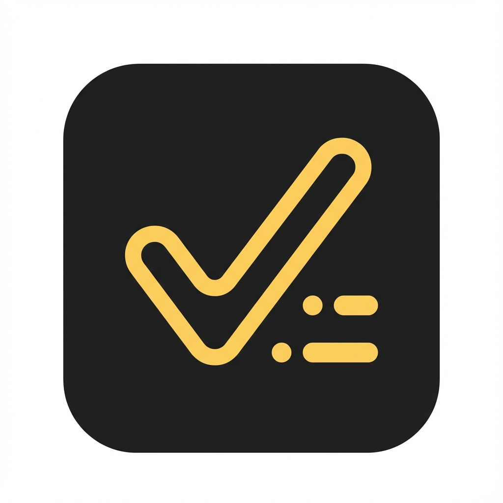

## ✨ Features

### 1. 📅 Smart Date Timeline
- **Horizontal Calendar**: Easily navigate through dates using the sleek horizontal timeline.
- **Date-Specific Tasks**: Tasks are organized by date. Select a date to view or add tasks for that specific day.
- **Visual Feedback**: The selected date is highlighted with a premium yellow accent.

### 2. 🎨 Beautiful UI & Theming
- **Premium Aesthetics**: Rounded corners, soft shadows, and a carefully curated color palette.
- **Dark & Light Mode**: Fully supports both Dark and Light themes.
  - **Light Mode**: Clean white/grey interface with subtle borders.
  - **Dark Mode**: Deep grey (`#1E1E1E`) background for eye comfort at night.
- **Animated Splash Screen**: Smooth fade and scale animation on launch with a seamless native transition.

### 3. ✅ Powerful Task Management
- **Recurring Tasks**: Set tasks to repeat Daily, Weekly, or Monthly. The app automatically creates the next instance when you complete the current one.
- **Subtasks**: Break down complex tasks into smaller, manageable steps. Track progress as you check them off.
- **Rich Text Editor**: Create detailed notes with **Bold**, *Italic*, lists, and more using the integrated Quill editor.
- **Add Tasks**: Quickly add tasks with a Title, Date, and Category.
- **Edit Tasks**: Tap any task to edit its details.
- **Delete**: Swipe left or tap the delete icon to remove a task.
- **Complete**: Mark tasks as done with a satisfying checkbox toggle.
- **Clear Date**: Use the **"Clear All"** button in the section header to instantly delete all tasks (active & completed) for the selected date.
- **Drag & Drop**: Long-press and drag to reorder your tasks for the day.

### 4. 🏷️ Categories & Filtering
- **Custom Categories**: Create your own categories with custom names and colors to suit your workflow.
- **Advanced Color Picker**: Choose the perfect color using a **Circular Hue Wheel**, or input precise **Hex**, **RGB**, or **HSL** codes.
- **Category Badges**: Organize tasks by categories like **Personal** (Blue), **Work** (Red), **Study** (Orange), and **Shopping** (Green).
- **Visual Tags**: Each task card displays its category with a colored pill badge.
- **Search**: Filter your tasks instantly by typing in the search bar.

### 5. 🔔 Smart Notifications & Reminders
- **Scheduled Reminders**: Set precise date and time reminders for your tasks.
- **Reliable Alerts**: Receive high-priority notifications with sound and vibration even when the app is closed.
- **Local Notifications**: Powered by `flutter_local_notifications` for robust performance.

### 6. 🚀 Smooth Performance
- **State Management**: Built using `Provider` for efficient state handling.
- **Persistence**: Tasks are saved locally using **Isar Database**, ensuring lightning-fast performance and offline capability.

### 7. 🔥 Gamification & Motivation
- **Streak Counter**: Track your daily consistency with a streak flame counter on the home screen.
- **Completion Sounds**: Get instant positive reinforcement with satisfying sound effects when checking off tasks (Toggleable in Settings).
- **Onboarding Flow**: A seamless introduction guide for new users to get started.

### 8. ⚙️ Settings & Personalization
- **New Settings UI**: A polished, card-based interface with elevated sections for a modern feel.
- **Theme Control**: Switch between Light, Dark, or System Default themes.
- **Notifications**: Toggle task reminders.
- **Sound Effects**: Enable/disable satisfying completion sounds.
- **Focus Configuration**: Customize your Pomodoro experience:
    - **Focus Duration**: Adjust work sessions (15-60 mins).
    - **Breaks**: Set Short (1-15 mins) and Long (5-45 mins) break durations.
    - **Daily Goal**: Set your target number of focus hours per day.

### 9. 🍅 Focus Mode (Pomodoro)
- **Built-in Timer**: A dedicated Focus Screen to help you stay productive.
- **Customizable Timer**: Work sessions and breaks are fully configurable.
- **Visual Progress**: A beautiful circular timer that visualizes your remaining time.
- **Task Integration**: Start a focus session directly from any task's detail view.
- **Gamification**: Track your daily focus progress against your goal.

## 📱 Screenshots

### 🚀 Splash Screen
| Splash 1 | Splash 2 |
|:---:|:---:|
| 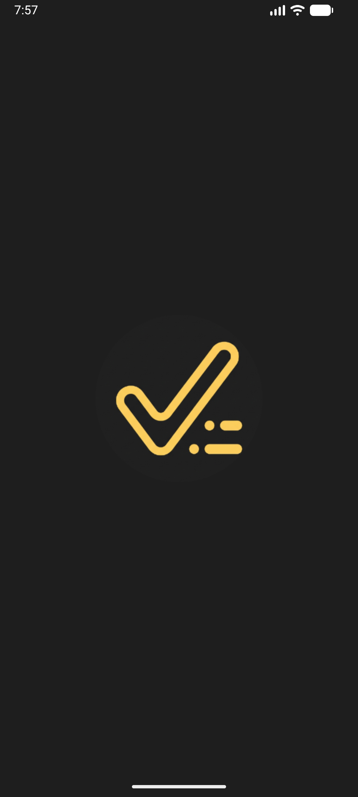 | 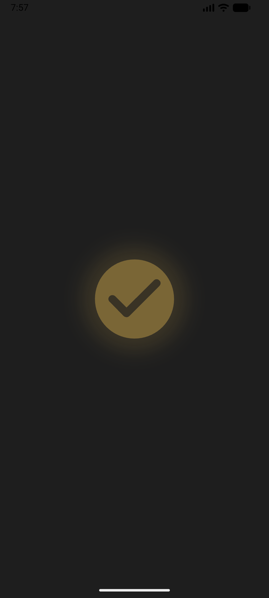 |

### 🏠 Home & Timeline
| Light Mode | Dark Mode |
|:---:|:---:|
| 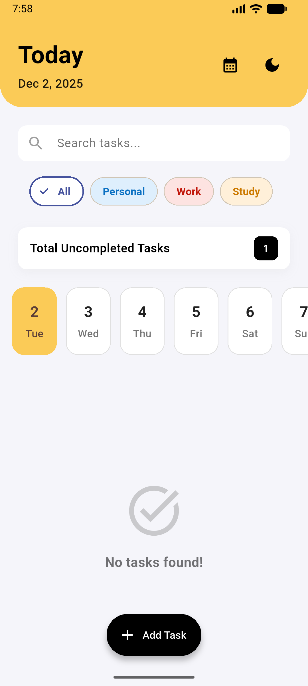 | 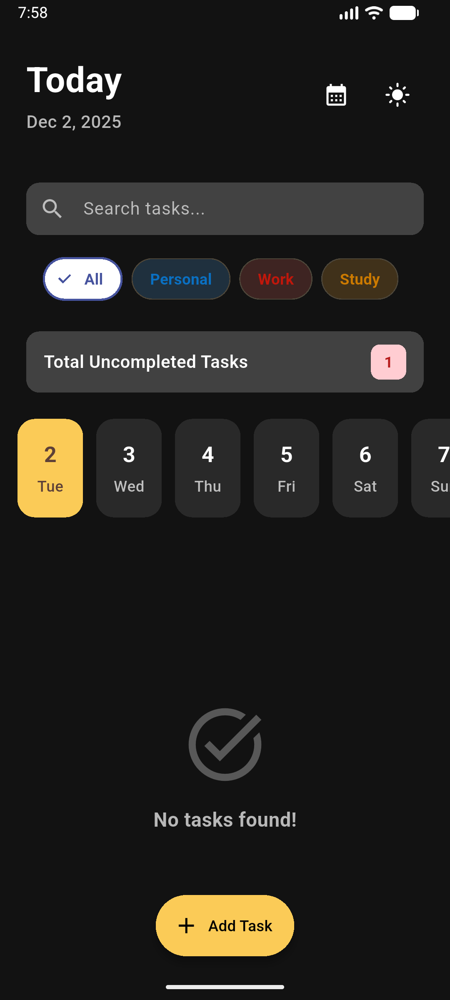 |

### 📅 Date View
| Light Mode | Dark Mode |
|:---:|:---:|
|  | 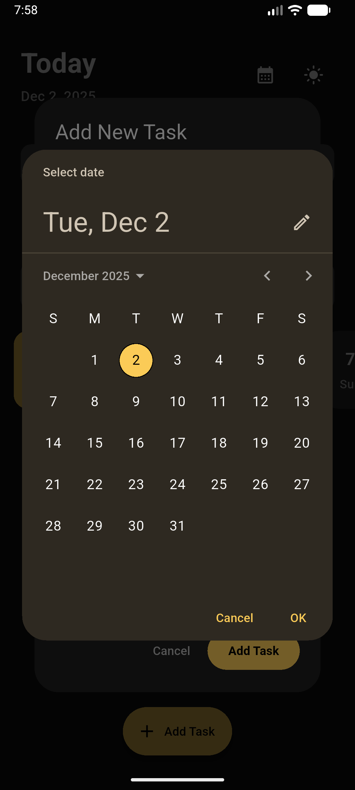 |

### 📝 Task Details
| Details (Light) | Details (Dark) |
|:---:|:---:|
| 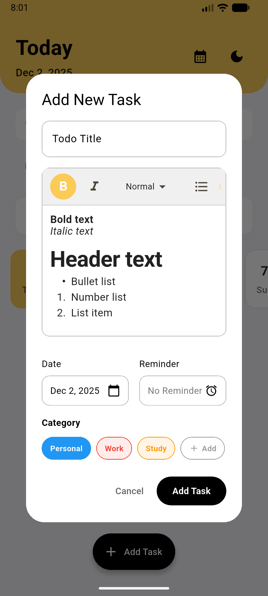 | 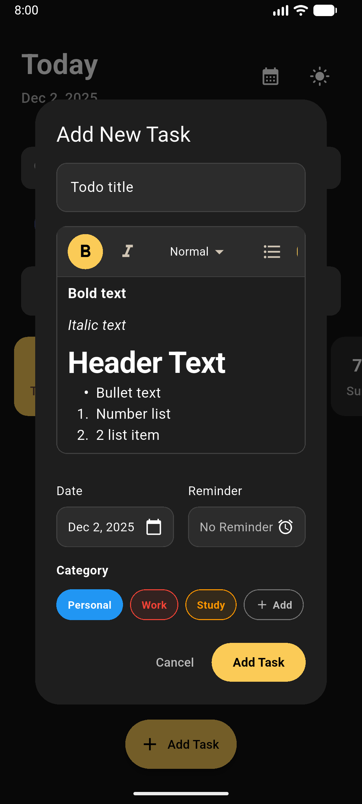 |

| View (Light) | View (Dark) |
|:---:|:---:|
| 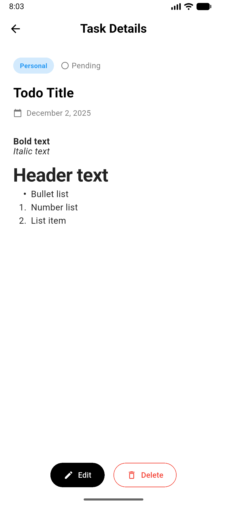 | 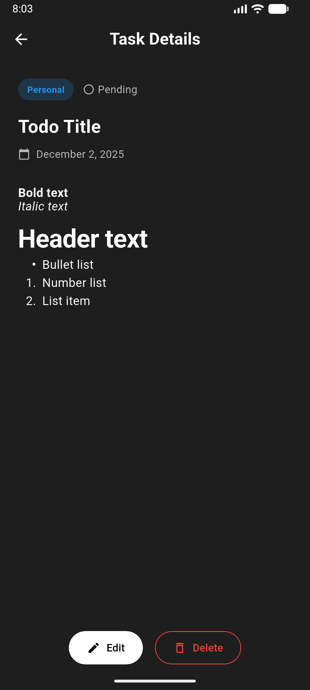 |

### ➕ Add & Manage Tasks
| Add Task | Complete Task 1 | Complete Task 2 |
|:---:|:---:|:---:|
| 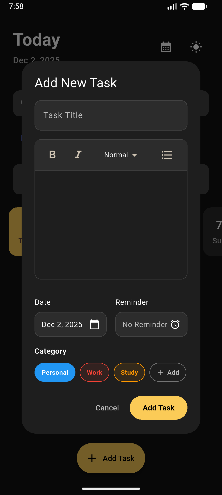 | 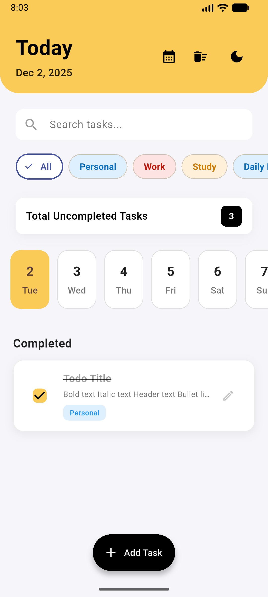 | 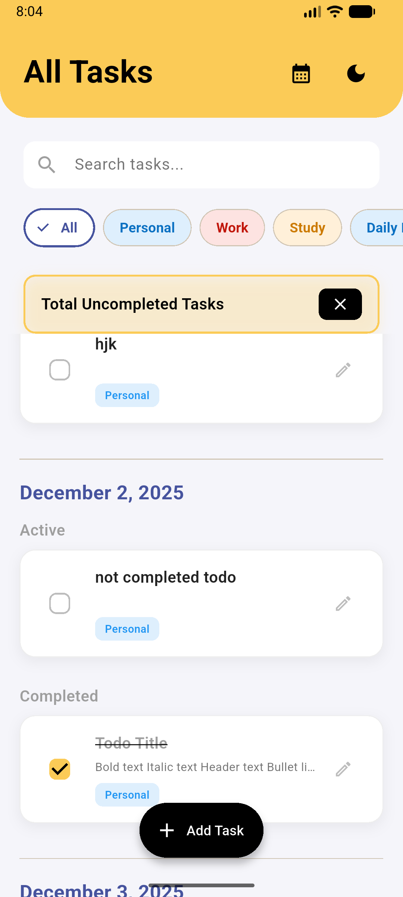 |

| Delete (Light) | Delete (Dark) |
|:---:|:---:|
| 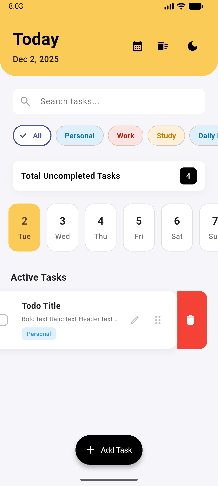 | 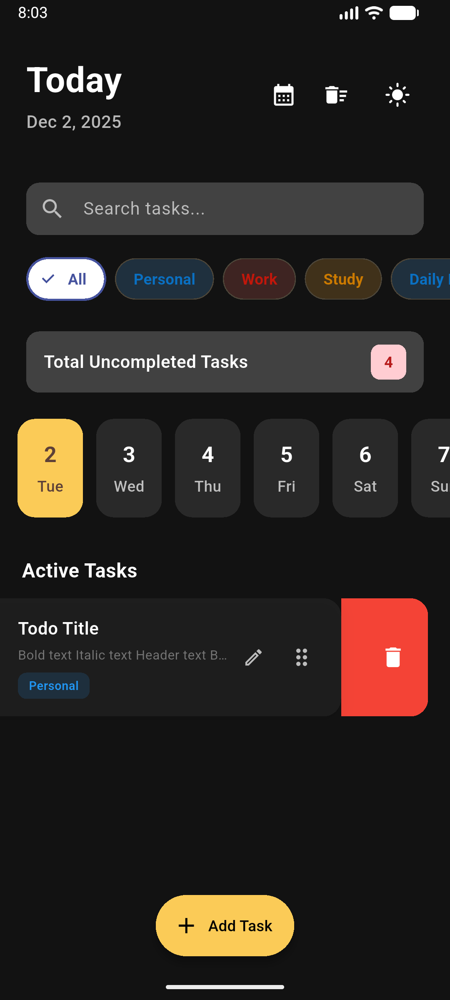 |

### 🏷️ Categories & Reminders
| Custom Category (Light) | Custom Category (Dark) |
|:---:|:---:|
| 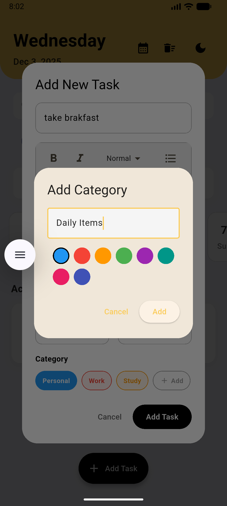 | 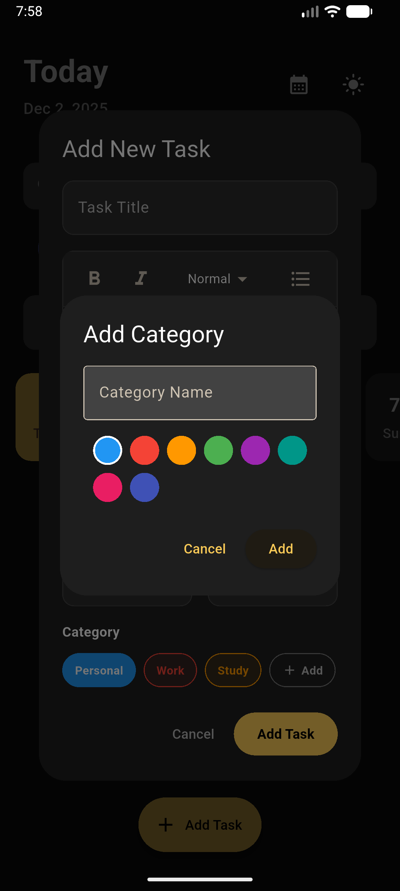 |

| Reminder (Light) | Reminder (Dark) |
|:---:|:---:|
| 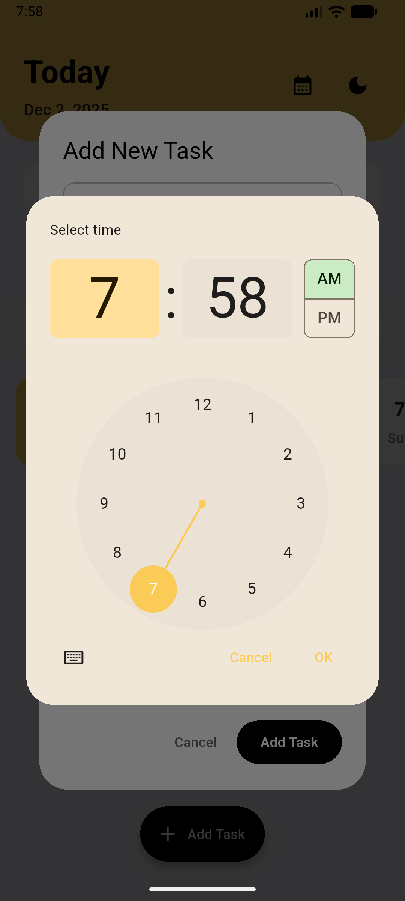 | 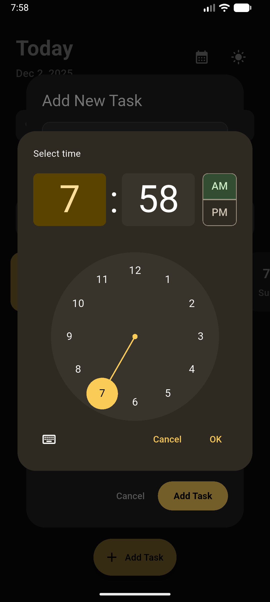 |

### 🔍 Other Views
| All Tasks | Notification |
|:---:|:---:|
| 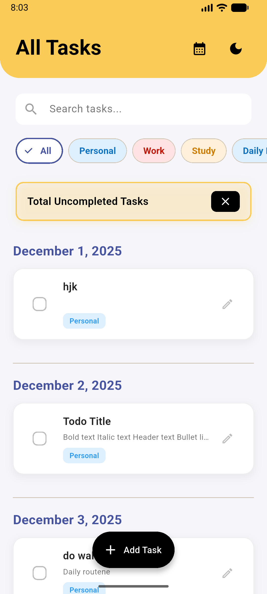 | 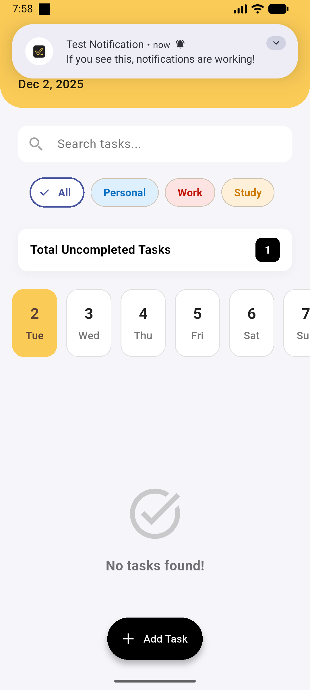 |

## 🛠️ Installation

1.  **Prerequisites**: Ensure you have Flutter installed (`flutter doctor`).
2.  **Clone the repository**:
    ```bash
    git clone https://github.com/yourusername/my_todo_app.git
    ```
3.  **Install dependencies**:
    ```bash
    flutter pub get
    ```
4.  **Run the app**:
    ```bash
    flutter run
    ```

## 📂 Project Structure

- `lib/main.dart`: Entry point and Theme configuration.
- `lib/providers/`: State management logic (`TodoProvider`, `ThemeProvider`).
- `lib/models/`: Data models (`Todo`, `CategoryModel`).
- `lib/screens/`: App screens (`HomeScreen`, `SplashScreen`).
- `lib/widgets/`: Reusable UI components.
    - `dialogs/`: `AddTodoDialog`, `AddCategoryDialog`.
    - `home/`: `DateTimeline`, `HomeHeader`, `TodoItem`, etc.